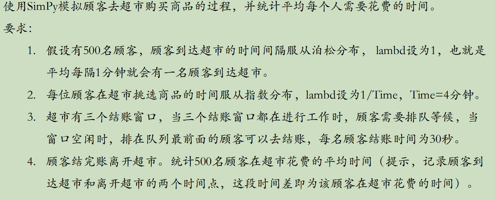
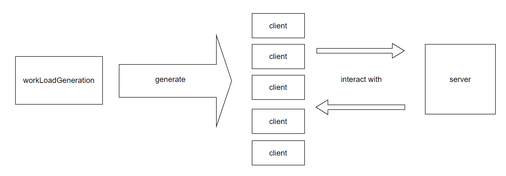

使用simpy进行的简单操作系统进程调度测试，测试题目如下：



## 要求：

python = 3.11

simpy >= 4 (实际使用4.1.1)

## 总结：

为了完成这个问题，采用类似CS的架构，客户端相当于用户，服务器端相当于超市，用户在超市进行商品选择，这个过程视作“前后端的交互”，同时有多个用户，即多进程，建模如下：



为了完成这个过程，具体代码逻辑如下图所示：

#### 1.workLoadGeneration:

这一处的代码负责启动多个Client（顾客）进行后台交互访问（具体负责的部分在Client中，workLoadGeneration只负责启动多个Client）

```python
# start.py
# 模拟前台工作流
workLoad = WorkLoad(500, env, 1 / 60)
```

上面的代码中，500表示数量， 1/60用于调整排队的人的间隔。

```python
# workLoadGeneraion.py
        while self.numClient != 0:
            currentId = self.clientId
            # Client端使用户进行工作
            currentClient = Client(self.env, currentId, self.messageBus, callbackRecodTime)


            # 启动Client端
            print(f"{self.env.now}  start Client {self.clientId}")
            # 记录Client端事件
            client_events.append(self.env.process(currentClient.run()))
            # 泊松分布等待一段时间(模拟下次用户到来,内部间隔实际服从指数分布)
            # yield self.env.timeout(stats.poisson.rvs( self.arrivalRate ))
            yield self.env.timeout(random.expovariate(self.arrivalRate))
            self.clientId += 1
            self.numClient -= 1

        yield AllOf(self.env, client_events)
```

上面的代码是workLoadGeneration的核心代码，负责循环启动多个Client（顾客）。其中，**self.env.timeout(random.expovariate(self.arrivalRate))服从指数分布**，以符合题意。根据概率论的知识，服从泊松分布的人群，人群的间隔会服从特定的指数分布。

#### 2.Client

这一处的代码负责具体启动客户端同Server交互，如下：

```python
# Client.py
    def run(self):
        # 模拟用户的购物流程
        self.startTime = self.env.now

        completionEvent = self.env.event()

        # 用messageBus
        requestChannel = self.messageBus.getChannel('customerRequest')

        yield requestChannel.put({  # 通过这个“bus”传递信息
            "customer": self.customer,
            "completionEvent": completionEvent
        })

        yield completionEvent  # 等待服务完成


        self.endTime = self.env.now

        self.callbackRecordTime(self.getCostTime())
```

上面的代码是Client部分的核心代码。run定义了每次通过self.env.process启动Client时执行的事件。其中，**messageBus相当于特定的数据总线，它的设计是为了隔离Server端和Client端，降低耦合性，使其更符合软件哲学**。我们将特定数据进行打包，以类似json的格式传输到自定义的MessageBus中。

#### 3.MessageBus

这是一个工具类，相当于一个“数据通路”，实现时使用了单例模式，如下：

```python
class MessageBus:

    _instance = None

    def __new__(cls, env = None):
        # 单例模式
        if cls._instance is None:
            cls._instance = super(MessageBus, cls).__new__(cls)
            if env is not None:
                cls._instance.init(env)
        return cls._instance
```

#### 4.Server

这是服务器端，通过MessageBus和前台隔离，它在启动后会持续监听，直到收到请求，如下所示：

```python
 def listen(self):

        requestChannel = self.messageBus.getChannel("customerRequest")
        # 持续监听
        while True:
            customerRequest = yield requestChannel.get()
            customer = customerRequest['customer']
            completionEvent = customerRequest['completionEvent']
            self.env.process(self.serveCustomer(customer, completionEvent))
```

上面的代码就是一个持续监听

```python
# Server.py
def serveCustomer(self, customer: Customer, completionEvent):
        # 服务
        # with self.update_lock.request() as req:
        #     # 1. 排队等待
        #     yield req

        # 1. 挑选商品
        yield self.env.process(self.selectItem(customer))

        with self.update_lock.request() as req:
            print(f"{self.env.now}  The service used now is {self.update_lock.count}")
            # 2. 排队等待
            yield req
            # 3. 结账
            yield self.env.process(self.checkout(customer))
            print(f"{self.env.now}  Customer {customer.id} is finish")

        # 通知客户端处理完毕
        completionEvent.succeed()
```

这是每次Server端listen到Client后执行的操作。serveCustomer中，对用户的操作进行的建模。这也符合Server端的需求，**将需要安全的操作封装在这里**，避免前台的恶意修改，这也符合正常人的逻辑。

```python
# Server.py
    def selectItem(self, customer : Customer):
        print(f"{self.env.now}  Customer {customer.id} is selecting item")

        # 服从特定的指数分布
        yield self.env.timeout(random.expovariate(self.rate_select))
    def checkout(self, customer : Customer):
        # 结账
        print(f"{self.env.now}  Customer {customer.id} is checking out")

        # 30s
        yield self.env.timeout(self.time_checkout)
```

这是具体用户操作时的函数。**selectItem使用特定的指数函数，checkout使用特定的time_checkout延时**，以满足题意。

#### 5.start.py

负责正常的启动，如下：

```python
    env = simpy.Environment()
    # 模拟服务器（正式部署时可能使用分布式，通过ip访问等，这里仅模拟）
    server = Server(env, 3, 1/240, 30)
    # 模拟前台工作流
    workLoad = WorkLoad(500, env, 1 / 60)
    print("启动工作")
    env.run()
```

上面启动了Server和workLoad（workLoad进一步启动一组Client0）。另外指定了一组参数，500代表Client数量，3代表Server端的最大并发数（窗口数量）， 1/240、1/60都是具体指数分布中的参数，以满足题意。 30代表延时。所有的操作以秒为单位。

#### 6.日志部分：

日志通常前面代表时间（s为单位），后面为事件（到来，离开，正在购物等），另外会有日志打印某个用户具体用了多长时间

日志最后一行，会打印平均时间


## 如何启动：

1. 创建一个虚拟环境（python = 3.11），按照pip install -r requirements.txt安装simpy库

2. python start.py即可


## 参考日志：

参考文件      某次运行示例\test.txt

## 结论：

多次实验后，发现大致用时约270s，几乎达到最短理论时间。观察日志，少数情况下需要等待，证明此时最大并发数能完全胜任这种情况。

